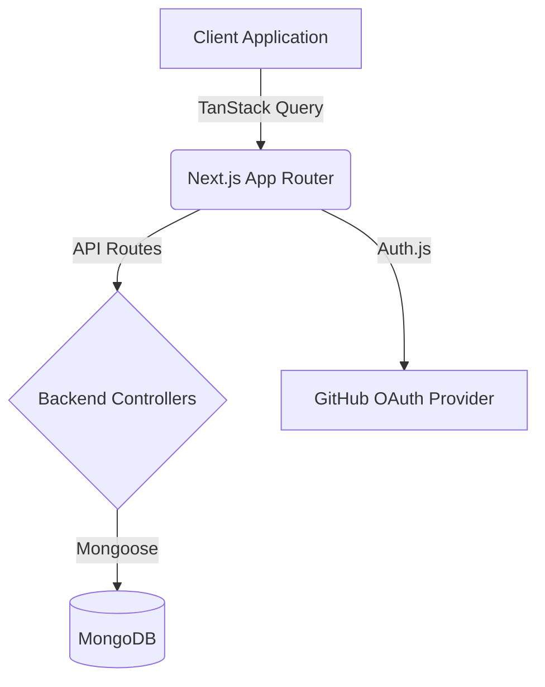

# Expense Insights

Expense Insights is a comprehensive web application designed to help users track their daily expenses, manage custom spending categories, and visualize their financial data over custom date ranges.

## Features

- **Dashboard Analytics**: Visualize spending patterns using interactive charts powered by Recharts.
- **Expense Management**: Add, view, and delete expenses with categorized tags.
- **Custom Categories**: Create and manage personalized expense categories.
- **Authentication**: Secure login system integrated with GitHub OAuth.
- **Date Filtering**: Filter expenses and aggregate dashboard metrics by custom date ranges.

## Architecture

The application is built with a modern web stack, utilizing Next.js for both the frontend and backend API routes, and MongoDB for persistent data storage.



## Technology Stack

- **Framework**: Next.js (App Router)
- **Styling**: Tailwind CSS, Shadcn UI
- **State Management**: TanStack React Query 
- **Database**: MongoDB with Mongoose
- **Authentication**: Auth.js (NextAuth v5)
- **Charts**: Recharts

## Getting Started

Follow these instructions to set up the project locally.

### Prerequisites

- Node.js (v18 or higher)
- A MongoDB Atlas cluster or local instance
- A GitHub OAuth Application

### Installation

1. Clone the repository and install dependencies:

```bash
npm install
```

2. Create a `.env.local` file in the root directory and add the following environment variables:

```env
MONGODB_URI=your_mongodb_connection_string
AUTH_SECRET=your_generated_auth_secret
AUTH_GITHUB_ID=your_github_oauth_client_id
AUTH_GITHUB_SECRET=your_github_oauth_client_secret
```

3. Start the development server:

```bash
npm run dev
```

4. Open [http://localhost:3000](http://localhost:3000) with your browser to see the application.
